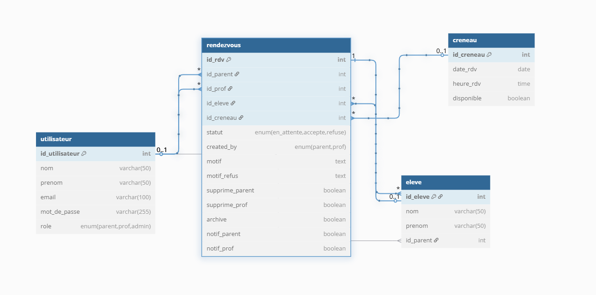

# 📅 Gestion des Rendez-vous Parents-Profs

Projet E6 – BTS SIO SLAM – Session 2025  
Application web pour faciliter la prise et gestion de RDV entre parents et enseignants.

---

## 🎯 Objectif du projet

Ce projet répond à une problématique courante dans les établissements scolaires :  
la gestion manuelle des rendez-vous entraîne des conflits, oublis et pertes de temps.

👉 Cette application permet de :
- Centraliser les demandes de RDV
- Superviser les créneaux disponibles
- Répartir les rôles entre parents, professeurs et administrateurs

---

## 👤 Utilisateurs

| Rôle    | Fonction principale                                      |
|---------|----------------------------------------------------------|
| 👨‍👩‍👧‍👦 **Parent**    | Prendre un rendez-vous avec un professeur pour son enfant |
| 👩‍🏫 **Professeur** | Gérer les RDV attribués après validation admin         |
| 🛠️ **Admin**       | Gérer les créneaux, vérifier les demandes, surveiller le système |

---

## 🧠 Fonctionnalités clés

- 🔐 Authentification sécurisée (Parent / Prof / Admin)
- 📅 Prise de RDV sur créneaux paramétrables
- 📝 Motif obligatoire lors de la création
- 🔁 **Validation obligatoire par l'admin** avant que le prof voie le RDV
- ✅ Validation finale par le professeur
- 🔔 Notifications visuelles des demandes en attente
- ❌ Possibilité de refuser un RDV (avec justification)
- 🧽 Masquage des RDV supprimés côté prof/parent
- 📦 Archivage automatique des RDV expirés
- 👁️ Vue calendrier interactive côté admin (mois par mois)

---

## ⚙️ Technologies utilisées

- HTML / CSS
- PHP procédural
- MySQL
- EasyPHP Devserver 17
- PhpMyAdmin
- GitHub

---

## 🗂️ Structure du projet

- `connexion_bdd.php` → Connexion à la base
- `login.php / traitement_login.php` → Authentification
- `menu_parent.php / menu_prof.php / menu_admin.php` → Accueil par rôle
- `prendre_rdv.php` → Demande de RDV par un parent
- `gestion_rdv_admin.php` → Calendrier de gestion des RDV (admin)
- `mes_rdv_prof.php` → Liste des RDV visibles pour les professeurs
- `mes_rdv_parent.php` → Suivi des RDV par le parent
- `gestion_creneaux.php` → Gestion simple des créneaux horaires

---

## 🧱 Base de données

- ✅ 5 tables principales : `utilisateur`, `eleve`, `rendezvous`, `creneau`
- 🔁 Relations maîtrisées entre parent/enfant/prof/rdv
- 📌 Statuts gérés via `ENUM` : `en_attente`, `en_attente_prof`, `accepte`, `refuse`, `refuse_admin`

## 🗂️ Structure du dépôt

---

## 🗺️ MCD – Modèle Conceptuel de Données

---

## 📄 Documentation jointe

- ✅ [Cahier des charges](./doc/Cahier%20des%20charges.pdf)
- ✅ [README.md](README.md)
- 📁 [Base de données SQL](.sql/bdd_rdv.sql)

---
## 🔗 Accès au site en ligne

Le projet est hébergé en ligne gratuitement via InfinityFree.  
Vous pouvez accéder à la plateforme à l'adresse suivante :

👉 **[https://gestionrdv.infinityfreeapp.com](https://gestionrdv.infinityfreeapp.com)**

## ✍️ Auteur

**William Da Silva Ferreira Batista**  
BTS SIO – SLAM – 2025  
